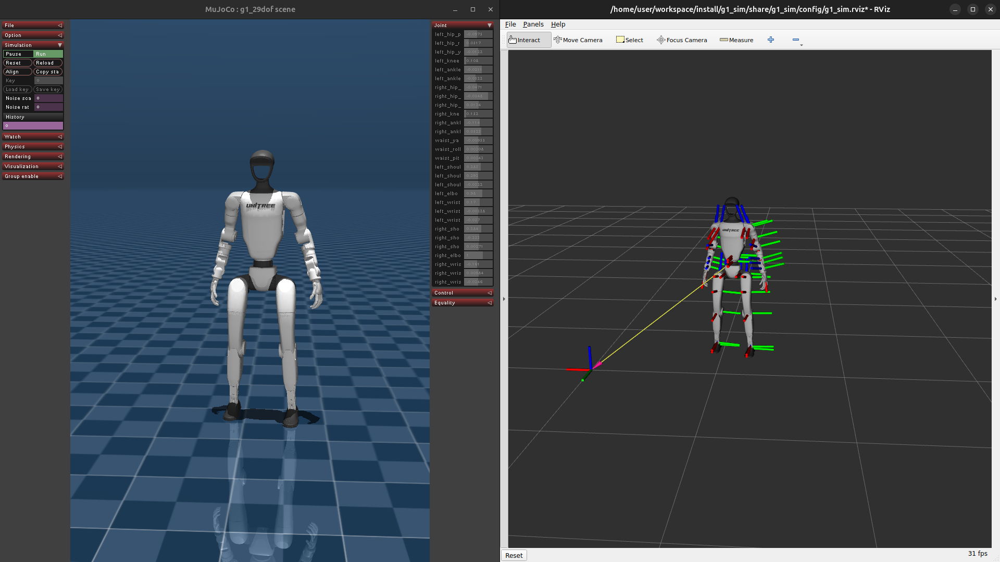

# g1_sim

ROS 2 Jazzy workspace for launching the Unitree G1 MuJoCo simulation through `unitree_mujoco`.




## Structure

- `src/g1_sim`: ROS 2 package with config, launch, and runner.
- `third_party/unitree_mujoco`: Git submodule with the upstream Unitree MuJoCo simulator and G1 MJCF assets.
- `third_party/unitree_rl_lab`: Git submodule with the official Unitree G1 deploy controller and pretrained policies.
- `docker/Dockerfile`: ROS 2 Jazzy image with Unitree SDK2, MuJoCo, and simulation dependencies.

## Build the Docker image

```bash
./docker/build.sh
```

Use `--no-cache` to force a clean rebuild:

```bash
./docker/build.sh --no-cache
```

## Start the container

For the MuJoCo viewer on Linux/X11:

```bash
xhost +local:docker
docker compose -f docker/docker-compose.yml up -d
```

Open a shell inside the running container:

```bash
docker exec -it g1_sim_jazzy bash
```

The entrypoint links MuJoCo into the submodule and builds `unitree_mujoco` and the official G1 RL controller on first container startup.

## Build and launch

Inside the container:

```bash
cb
ros2 launch g1_sim g1_sim.launch.py
```

The image defines these aliases:

- `cb`: build the workspace with `colcon build --symlink-install --cmake-args -DCMAKE_BUILD_TYPE=Release` and source `install/setup.bash`.
- `cs`: source `install/setup.bash`.

The launch starts:

- `unitree_mujoco_runner`: Unitree MuJoCo simulator.
- `g1_rl_controller_runner`: official Unitree RL Lab G1 controller using the pretrained velocity `policy.onnx`.
- `g1_mujoco_ros_bridge`: MuJoCo-to-ROS bridge for `/tf`, `/joint_states`, `/g1/mujoco_markers`, and MuJoCo groundtruth `odom -> pelvis`.
- `g1_cmd_vel_bridge`: optional `/cmd_vel` to Unitree high-level request bridge. The current G1 MuJoCo path does not consume `/api/sport/request`, so the RL controller is the useful locomotion path.
- `rviz2`: enabled by default.

Nav2 navigation-only launch, without localization, AMCL, SLAM, or map server:

```bash
ros2 launch g1_nav g1_nav.launch.py
```

`g1_nav` uses `odom` as the navigation frame, `pelvis` as the robot base frame, and publishes smoothed velocity commands to `/cmd_vel`.

Useful launch arguments:

```bash
ros2 launch g1_sim g1_sim.launch.py scene:=scene_23dof.xml domain_id:=2
ros2 launch g1_sim g1_sim.launch.py print_scene_information:=0
ros2 launch g1_sim g1_sim.launch.py unitree_mujoco_dir:=/path/to/unitree_mujoco
ros2 launch g1_sim g1_sim.launch.py unitree_rl_lab_dir:=/path/to/unitree_rl_lab
ros2 launch g1_sim g1_sim.launch.py use_rviz:=false
ros2 launch g1_sim g1_sim.launch.py use_rl_controller:=false use_cmd_vel_bridge:=true
```

For G1 locomotion, use the upstream RL controller flow:

1. Launch the simulation with the default arguments.
2. The wrapper auto-enters `FixStand` after `rl_fixstand_delay` seconds.
3. The wrapper auto-enters `Velocity` after `rl_velocity_delay` seconds in `FixStand`.
4. Lower the feet and release the elastic band from MuJoCo.

Without a joystick, the wrapper patches a runtime copy of the official controller so the velocity policy subscribes directly to `/cmd_vel`:

```bash
ros2 topic pub /cmd_vel geometry_msgs/msg/Twist \
  "{linear: {x: 0.25, y: 0.0, z: 0.0}, angular: {x: 0.0, y: 0.0, z: 0.1}}" -r 10
```

The patched controller writes zero velocity if no `/cmd_vel` arrives for `policy_cmd_vel_timeout` seconds. The command values are passed through linearly as `vx`, `vy`, and `yaw` in m/s, m/s, and rad/s. Linear velocity is clamped to the official policy range, and yaw is only limited by `policy_cmd_vel_yaw_limit` for safety.

MuJoCo publishes the floating-base groundtruth on `/g1/mujoco_base_pose`, and the visualization bridge uses it as the root TF. RViz uses `odom` as the fixed frame by default.

If `xdotool` can see the MuJoCo window over X11, these replace the MuJoCo keyboard steps:

```bash
ros2 run g1_sim g1_mujoco_key 8  # lower feet
ros2 run g1_sim g1_mujoco_key 9  # release elastic band
```

If `xdotool` cannot find the window, click the MuJoCo window and press `8`/`9` manually. The original joystick transitions are still available by launching with `rl_auto_start:=false`.

The `/cmd_vel` bridge is kept for experiments with a high-level Unitree API server, but the current G1 MuJoCo controller path does not consume `/api/sport/request`.

The Unitree ROS 2 message packages from `third_party/unitree_ros2` are built with the workspace so `ros2 topic list`, `ros2 topic info`, and `ros2 topic echo` can resolve Unitree DDS topics such as `/rt/lowstate`.

The default config launches `g1` with `scene_29dof.xml`, DDS domain `0`, interface `docker0`, joystick enabled, and the humanoid elastic band enabled for startup. DDS domain `0` matches the official `g1_ctrl` controller.
